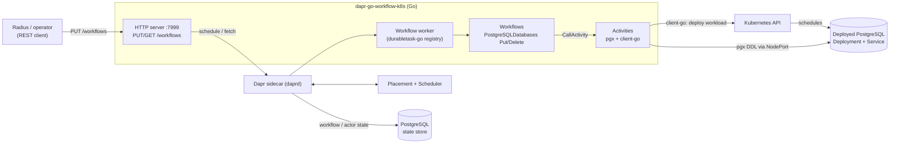

# Radius Recipes on Dapr Durable Workflows — Go Reference Service

[](https://github.com/AndriyKalashnykov/dapr-go-workflow-k8s/actions/workflows/ci.yml)
[](https://hits.sh/github.com/AndriyKalashnykov/dapr-go-workflow-k8s/)
[](https://opensource.org/licenses/MIT)
[](https://app.renovatebot.com/dashboard#github/AndriyKalashnykov/dapr-go-workflow-k8s)
[](https://pkg.go.dev/github.com/AndriyKalashnykov/dapr-go-workflow-k8s)

Reference Go service that drives **[Radius](https://radapp.io/) Recipes** through **[Dapr](https://dapr.io/) durable workflows**. The **runtime surface** is a small REST API that schedules durable workflows (`durabletask-go` registry + `dapr/go-sdk`) which **deploy a real PostgreSQL workload** (Deployment + Service + Secret via [`client-go`](https://github.com/kubernetes/client-go)) and **provision a role + database on it** (via [`pgx`](https://github.com/jackc/pgx)), returning recipe outputs (`values`, `secrets`, `resources`) in the shape Radius expects; the **delivery surface** ships a distroless image, a real Dapr-sidecar + kind end-to-end test (`make e2e`) that deploys/provisions/tears down against a live cluster, a `mise`-pinned toolchain, a `static-check` gate (golangci-lint, govulncheck, gitleaks, Trivy, hadolint, actionlint/shellcheck, mermaid-lint), and a GitHub Actions pipeline with a blocking Trivy scan and cosign keyless image signing, with Renovate-managed dependencies.

> **The activities deploy a real PostgreSQL workload.** `PostgresSQLDatabasesPut` uses **client-go** to deploy a dedicated PostgreSQL Deployment + Service + Secret per resource, waits for the rollout, then runs real DDL (`CREATE ROLE` / `CREATE DATABASE`) via **pgx** on the deployed instance (reached via the Service's node-IP:NodePort). The returned recipe URI is genuinely connectable; `PostgresSQLDatabasesDelete` destroys the workload. `make e2e` verifies the whole cycle against a real kind cluster. The remaining extension point is wiring the Azure/AWS provider scopes.

| Component | Technology |
|-----------|------------|
| Language | Go 1.26.4 |
| Workflow engine | [Dapr durable workflows](https://docs.dapr.io/developing-applications/building-blocks/workflow/) via `dapr/durabletask-go` v0.12 |
| Dapr SDK | `dapr/go-sdk` v1.15 (runtime ≥ 1.18) |
| HTTP | Go stdlib `net/http` (`http.ServeMux`, method + path routing) |
| Recipe contract | Radius Recipe `Context` / `Result` types (`pkg/recipes`) |
| PostgreSQL backend | [`jackc/pgx`](https://github.com/jackc/pgx) v5 (real role/database provisioning) |
| Kubernetes backend | [`k8s.io/client-go`](https://github.com/kubernetes/client-go) (deploys the PostgreSQL Deployment + Service + Secret) |
| Deployed workload | `postgres:18-alpine` (Renovate-tracked, env-tunable `POSTGRES_WORKLOAD_IMAGE`) |
| State store | PostgreSQL (Dapr `state.postgresql` component) |
| Container | `gcr.io/distroless/static-debian12:nonroot` (multi-stage build) |
| CI / security | GitHub Actions, Trivy, gitleaks, govulncheck, cosign keyless signing |
| Toolchain / deps | mise-pinned tools, Renovate |

## Quick Start

```bash
make deps             # install toolchain + quality tools (via mise)
make ci               # full local pipeline: format + static-check + test + coverage + build

# Run the workflow end to end (needs Docker, the Dapr CLI, and a reachable
# kubeconfig — the recipe deploys a real PostgreSQL workload into the cluster):
make postgres-start   # start a local PostgreSQL state store (the admin endpoint)
make run              # run the app under a Dapr sidecar (uses KUBECONFIG / ~/.kube/config)
./start-workflow.sh   # health-check, PUT a workflow, poll until it completes
make postgres-stop    # tear down PostgreSQL

# Or the fully-automated version (spins up its own kind cluster):
make e2e
```

## Prerequisites

| Tool | Version | Purpose | Install |
|------|---------|---------|---------|
| [GNU Make](https://www.gnu.org/software/make/) | 3.81+ | Build orchestration | per-platform |
| [Git](https://git-scm.com/) | latest | Source control | per-platform |
| [mise](https://mise.jdx.dev) | latest | Manages the Go toolchain and all quality/security tools | `curl https://mise.run \| sh` (or `make deps`) |
| [Docker](https://docs.docker.com/get-docker/) | latest | Local PostgreSQL + container image builds | per-platform |
| [Dapr CLI](https://docs.dapr.io/getting-started/install-dapr-cli/) | `.mise.toml`-pinned | Runs the app with a sidecar; `dapr init` bootstraps the runtime | `make deps` (mise) |
| [kind](https://kind.sigs.k8s.io/) | `.mise.toml`-pinned | Local Kubernetes cluster for `make e2e` | `make deps` (mise) |
| [kubectl](https://kubernetes.io/docs/reference/kubectl/) | `.mise.toml`-pinned | Talks to the cluster the recipe deploys into | `make deps` (mise) |

`make deps` bootstraps mise and installs the Go toolchain plus `dapr` (CLI), `kind`, `kubectl`, `golangci-lint`, `gitleaks`, `trivy`, `hadolint`, `actionlint`, `shellcheck`, `act`, `goreleaser`, and `govulncheck` — all pinned in `.mise.toml`.

## Architecture

One binary runs two cooperating runtimes that share a single Dapr client:

1. **Dapr workflow worker** — registers the workflow and activity functions with a `durabletask-go` registry and starts a worker that talks to the Dapr sidecar.
2. **HTTP server** (`:7999`, configurable via `APP_PORT`) — exposes:
   - `GET /healthz` → `{"status":"ok"}`
   - `PUT /workflows` → schedule a workflow by name; returns `201 {"id": <instanceID>}`
   - `GET /workflows/{id}` → fetch a workflow instance's status

Request flow: a client `PUT`s a workflow name + JSON input → the server schedules it on the worker → the worker runs the workflow → the workflow calls activities → the client polls `GET /workflows/{id}` until the status is terminal.



```text
cmd/
  main.go          - Application entrypoint (worker + HTTP server)
  healthcheck/     - Dependency-free container HEALTHCHECK probe
pkg/
  activities/      - Dapr workflow activities: deploy a Postgres workload (client-go) + provision role/db on it (pgx)
  recipes/         - Radius Recipe contract types (Context / Result)
  server/          - HTTP server, routes, and the workflow-status DTO
  workflows/       - Durable workflow definitions (PostgreSQL databases put/delete)
components/        - Dapr component configs (statestore, tracing config)
db/               - PostgreSQL initialization script
```

## Configuration

All operator-tunable values are documented in [`.env.example`](.env.example). Copy it to `.env` to override locally; the shell scripts source both, and the `Makefile` reads `.env` too (`-include .env`). Key variables:

| Variable | Default | Purpose |
|----------|---------|---------|
| `APP_PORT` | `7999` | HTTP listen port (must match the Dapr sidecar `--app-port`) |
| `DAPR_APP_ID` | `sample` | Dapr application id |
| `DAPR_GRPC_PORT` | `50001` | Dapr sidecar gRPC port |
| `POSTGRES_PASSWORD` | see [`.env.example`](.env.example) | Local dev PostgreSQL superuser password (single source of truth in `.env.example`) |
| `POSTGRES_PORT` | `5432` | Local dev PostgreSQL port |
| `POSTGRES_WORKLOAD_IMAGE` | `postgres:18-alpine` | Image the recipe deploys as the database workload (Renovate-tracked) |
| `KUBECONFIG` | `~/.kube/config` | Cluster the recipe deploys the PostgreSQL workload into (`make e2e` uses its own kind cluster) |

Fixed host ports are guarded before every bind by `make check-ports` (a prerequisite of `e2e`/`run`/`postgres-start`); on a collision it fails early naming the holder, and you override the matching `*_PORT` (e.g. in `.env`).

## Make Targets

Run `make help` to see all targets.

### Build & Run

| Target | Description |
|--------|-------------|
| `make deps` | Install the toolchain (Go + quality tools) via mise |
| `make deps-check` | Show the Go version and mise-managed tool status |
| `make get` | Download and tidy dependencies |
| `make update` | Update dependencies to latest versions |
| `make build` | Build the linux/amd64 binary to `./cmd/main` |
| `make run` | Run the app via the Dapr sidecar |
| `make check-ports` | Fail early if a guarded host port (Postgres/app/gRPC) is already in use |
| `make check-env` | STOPPER — fail if the committed `.env.example` source-of-truth is missing |
| `make clean` | Remove build artifacts |

### Testing

| Target | Description |
|--------|-------------|
| `make test` | Unit tests with race detector + coverage (seconds; hermetic — fakes + client-go fake clientset) |
| `make coverage-check` | Verify coverage meets `COVERAGE_THRESHOLD` (default 40%) |
| `make e2e-deps` | Ensure the Dapr control plane (placement + scheduler) is up |
| `make e2e` | End-to-end: real Dapr sidecar + a kind cluster; deploys a PostgreSQL workload, verifies the role/DB on it + idempotent re-Put, then destroys the workload (minutes; needs Docker + Dapr CLI) |

### Code Quality

| Target | Description |
|--------|-------------|
| `make format` | Auto-format Go source (gofmt + goimports via golangci-lint) |
| `make check-go-alignment` | Verify the Go version matches across `go.mod`, `.mise.toml`, `Dockerfile` |
| `make lint` | golangci-lint + `go mod tidy` check + hadolint + script `+x` guard |
| `make lint-ci` | Lint GitHub Actions workflows (actionlint) and shell scripts (shellcheck) |
| `make vulncheck` | govulncheck dependency vulnerability scan |
| `make secrets` | gitleaks secret scan |
| `make trivy-fs` | Trivy filesystem scan (vuln, secret, misconfig) |
| `make mermaid-lint` | Validate Mermaid diagrams in markdown (same engine GitHub renders with) |
| `make static-check` | Composite quality gate (env + alignment + workflow lint + lint + vuln + secrets + trivy + mermaid) |

### Local Infra & Containers

| Target | Description |
|--------|-------------|
| `make postgres-start` | Start a local PostgreSQL container (state store) |
| `make postgres-stop` | Stop the local PostgreSQL container |
| `make image-build` | Build the container image |
| `make image-run` | Run the container image locally (needs a healthy Dapr sidecar) |
| `make image-stop` | Stop the local container |
| `make image-push` | Push the container image to the registry |

### CI & Release

| Target | Description |
|--------|-------------|
| `make ci` | Full local CI pipeline (mirrors GitHub Actions) |
| `make ci-run` | Run the GitHub Actions workflow locally via [act](https://github.com/nektos/act) |
| `make renovate-validate` | Validate `renovate.json` against the Renovate config schema |
| `make release` | Create and push a new release tag (`vN.N.N`) |
| `make version` | Print the current version (git tag) |

## CI/CD

| Workflow | Trigger | Jobs |
|----------|---------|------|
| `ci.yml` | push to `main`, `v*` tags, PRs | `changes` → `static-check` / `build` / `test` / `e2e` → `docker` → `ci-pass` |
| `release.yml` | `v*.*.*` tags | reuses `ci.yml`, then GoReleaser publishes binaries + GitHub Release |
| `cleanup-runs.yml` | weekly / dispatch | prunes old workflow runs and caches |

The `e2e` job runs `make e2e`, which `dapr init`s a real control plane, starts the state-store PostgreSQL, creates a kind cluster, runs the app under a Dapr sidecar, and asserts the recipe **actually deployed a PostgreSQL workload** (ready Deployment) and provisioned a role + database on it (the credentials authenticate over the Service's NodePort) — then re-Puts idempotently and `PostgresSQLDatabasesDelete` destroys the workload (kind + kubectl come from mise). The `docker` job builds the image and runs a blocking Trivy scan on every push; on a tag it publishes a cosign-signed `linux/amd64` image to `ghcr.io/andriykalashnykov/dapr-go-workflow-k8s`. Branch protection requires the `ci-pass` check before merging (including for Renovate automerge).

> **Dapr runtime ≥ 1.18 is required.** go-sdk v1.15 / durabletask-go v0.12 fail activity invocation on older runtimes (`required metadata dapr-callee-app-id ... not found`). `make e2e` installs the version pinned by `DAPR_RUNTIME_VERSION` (default 1.18.0).

## Contributing

Contributions welcome — open a PR. Run `make ci` locally before pushing; CI gates every change on the `ci-pass` check.

## License

[MIT](LICENSE).
