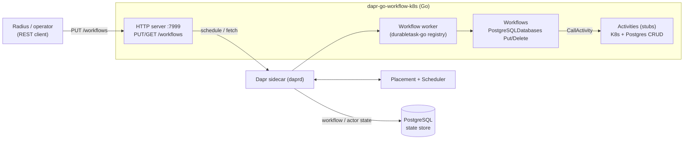

# dapr-go-workflow-k8s

[](https://github.com/AndriyKalashnykov/dapr-go-workflow-k8s/actions/workflows/ci.yml)
[](https://pkg.go.dev/github.com/AndriyKalashnykov/dapr-go-workflow-k8s)

A Go service that drives **[Radius](https://radapp.io/) Recipes** via **[Dapr](https://dapr.io/) durable workflows**. It exposes a small REST API that schedules Dapr workflows; each workflow orchestrates activities to provision (or tear down) a PostgreSQL database and its backing Kubernetes resources, then returns recipe outputs (values, secrets, resources) in the shape Radius expects.

> **Note:** the workflow activities are demo stubs — they log and simulate work rather than calling real Kubernetes / PostgreSQL APIs. Treat this repository as a Radius-recipe-on-Dapr-workflows scaffold; wiring the activities to real backends is the intended extension point.

## Architecture

One binary runs two cooperating runtimes that share a single Dapr client:

1. **Dapr workflow worker** — registers the workflow and activity functions with a `durabletask-go` registry and starts a worker that talks to the Dapr sidecar.
2. **HTTP server** (`:7999`, configurable via `APP_PORT`) — exposes:
   - `GET /healthz` → `{"status":"ok"}`
   - `PUT /workflows` → schedule a workflow by name; returns `201 {"id": <instanceID>}`
   - `GET /workflows/{id}` → fetch a workflow instance's status

Request flow: a client `PUT`s a workflow name + JSON input → the server schedules it on the worker → the worker runs the workflow → the workflow calls activities → the client polls `GET /workflows/{id}` until the status is terminal.



```
cmd/
  main.go          - Application entrypoint (worker + HTTP server)
  healthcheck/     - Dependency-free container HEALTHCHECK probe
pkg/
  activities/      - Dapr workflow activities (K8s deploy/delete, Postgres user/db CRUD) — demo stubs
  recipes/         - Radius Recipe contract types (Context / Result)
  server/          - HTTP server, routes, and the workflow-status DTO
  workflows/       - Durable workflow definitions (PostgreSQL databases put/delete)
components/        - Dapr component configs (statestore, tracing config)
db/               - PostgreSQL initialization script
```

## Prerequisites

| Tool | Purpose | Install |
|------|---------|---------|
| [mise](https://mise.jdx.dev) | Manages the Go toolchain and all quality/security tools | `curl https://mise.run \| sh` (or `make deps`) |
| [Docker](https://docs.docker.com/get-docker/) | Local PostgreSQL + container image builds | per-platform |
| [Dapr CLI](https://docs.dapr.io/getting-started/install-dapr-cli/) | Running the app with a sidecar | `dapr init` |

`make deps` bootstraps mise and installs the Go toolchain plus `golangci-lint`, `gitleaks`, `trivy`, `hadolint`, `actionlint`, `shellcheck`, `act`, `goreleaser`, and `govulncheck` — all pinned in `.mise.toml`.

## Quick Start

```bash
make deps             # install toolchain + quality tools (via mise)
make ci               # full local pipeline: format + static-check + test + coverage + build

# Run the workflow end to end (needs Docker + the Dapr CLI):
make postgres-start   # start a local PostgreSQL state store
make run              # run the app under a Dapr sidecar
./start-workflow.sh   # health-check, PUT a workflow, poll until it completes
make postgres-stop    # tear down PostgreSQL
```

## Make Targets

```
make deps             - Install toolchain (Go + quality tools) via mise
make build            - Build linux/amd64 binary to ./cmd/main
make test             - Run unit tests with race detector and coverage
make coverage-check   - Verify coverage meets COVERAGE_THRESHOLD (default 40%)
make format           - Auto-format Go source (gofmt + goimports)
make lint             - golangci-lint + go mod tidy check + hadolint
make lint-ci          - Lint workflows (actionlint) and shell scripts (shellcheck)
make vulncheck        - govulncheck dependency vulnerability scan
make secrets          - gitleaks secret scan
make trivy-fs         - Trivy filesystem scan (vuln, secret, misconfig)
make static-check     - Composite quality gate (alignment + all of the above)
make ci               - Full local CI pipeline
make ci-run           - Run the GitHub Actions workflow locally via act
make e2e              - End-to-end test: run the workflow through a real Dapr sidecar
make run              - Run the app via the Dapr sidecar
make postgres-start   - Start a local PostgreSQL container
make postgres-stop    - Stop the local PostgreSQL container
make image-build      - Build the container image
make image-push       - Push the container image to ghcr.io
make release          - Create and push a new release tag (vN.N.N)
make help             - List all targets
```

## Configuration

All operator-tunable values are documented in [`.env.example`](.env.example). Copy it to `.env` to override locally; `run-dapr.sh` and `run-postgres.sh` source both. Key variables:

| Variable | Default | Purpose |
|----------|---------|---------|
| `APP_PORT` | `7999` | HTTP listen port (must match the Dapr sidecar `--app-port`) |
| `DAPR_APP_ID` | `sample` | Dapr application id |
| `DAPR_GRPC_PORT` | `50001` | Dapr sidecar gRPC port |
| `POSTGRES_PASSWORD` | `daprrulz` | Local dev PostgreSQL password |
| `POSTGRES_PORT` | `5432` | Local dev PostgreSQL port |

## CI/CD

| Workflow | Trigger | Jobs |
|----------|---------|------|
| `ci.yml` | push to `main`, `v*` tags, PRs | `changes` → `static-check` / `build` / `test` / `e2e` → `docker` → `ci-pass` |
| `release.yml` | `v*.*.*` tags | reuses `ci.yml`, then GoReleaser publishes binaries + GitHub Release |
| `cleanup-runs.yml` | weekly / dispatch | prunes old workflow runs and caches |

The `e2e` job runs `make e2e`, which `dapr init`s a real control plane, starts PostgreSQL, runs the app under a Dapr sidecar, schedules `PostgresSQLDatabasesPut`, and asserts the recipe output. The `docker` job builds the image and runs a blocking Trivy scan on every push; on a tag it publishes a cosign-signed `linux/amd64` image to `ghcr.io/andriykalashnykov/dapr-go-workflow-k8s`. Branch protection requires the `ci-pass` check before merging (including for Renovate automerge).

> **Dapr runtime ≥ 1.18 is required.** go-sdk v1.15 / durabletask-go v0.12 fail activity invocation on older runtimes (`required metadata dapr-callee-app-id ... not found`). `make e2e` installs the version pinned by `DAPR_RUNTIME_VERSION` (default 1.18.0).
